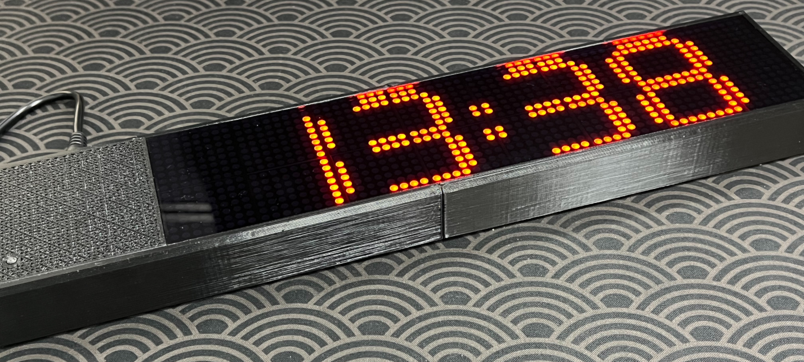
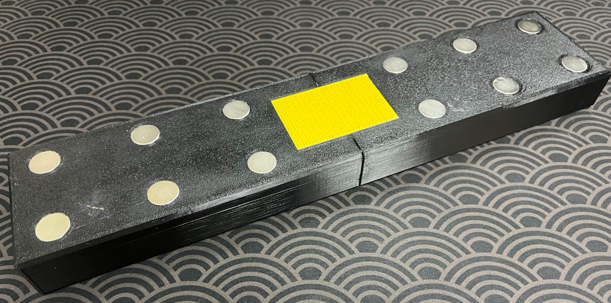
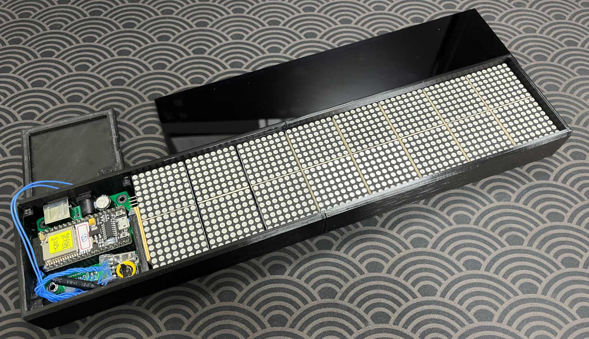
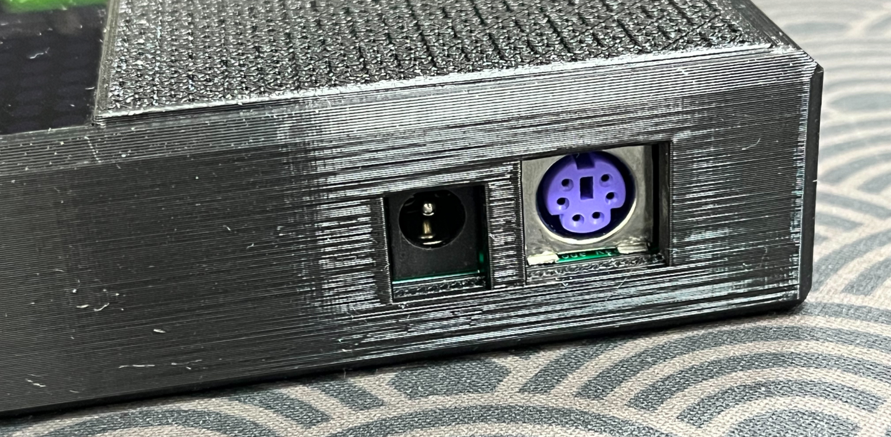
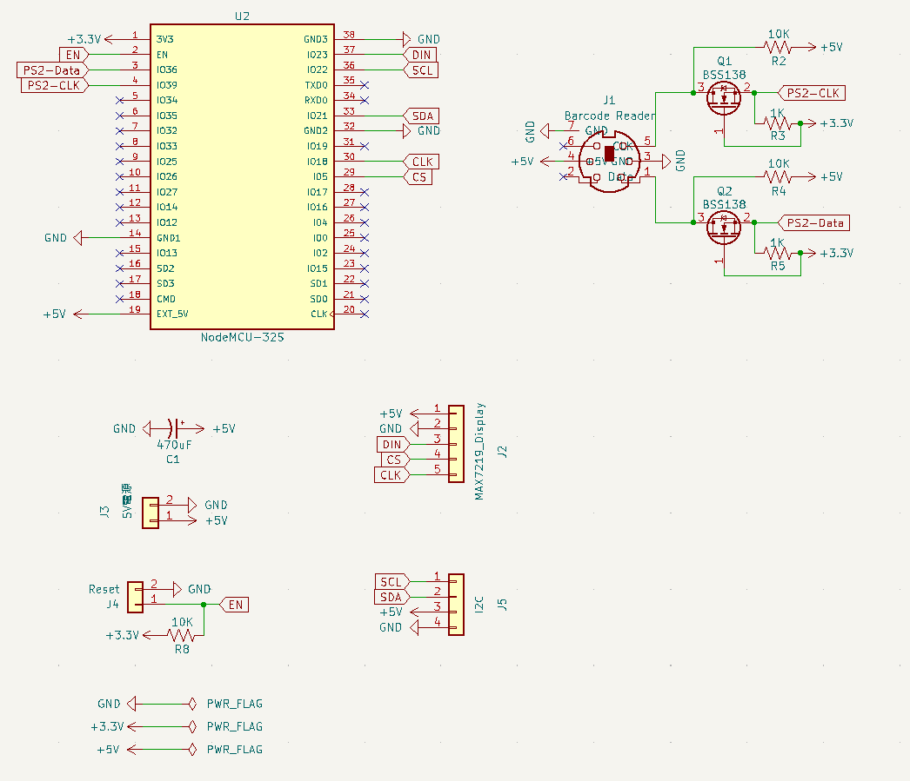
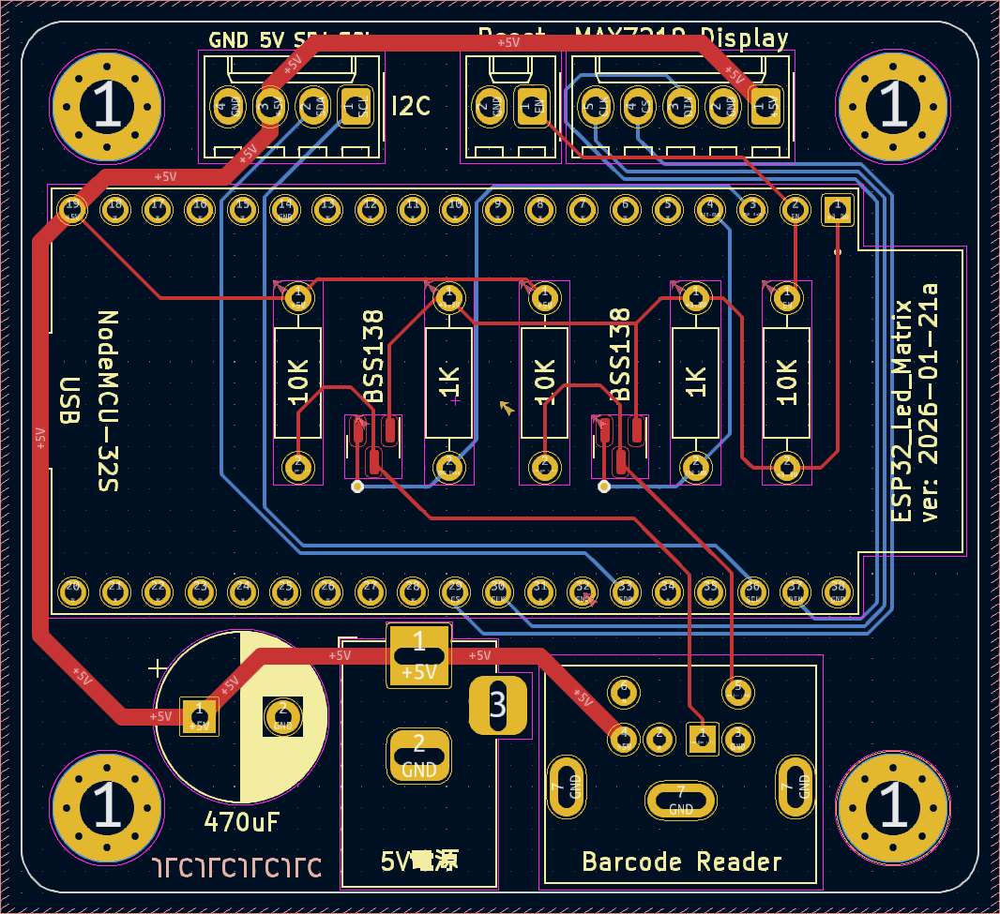
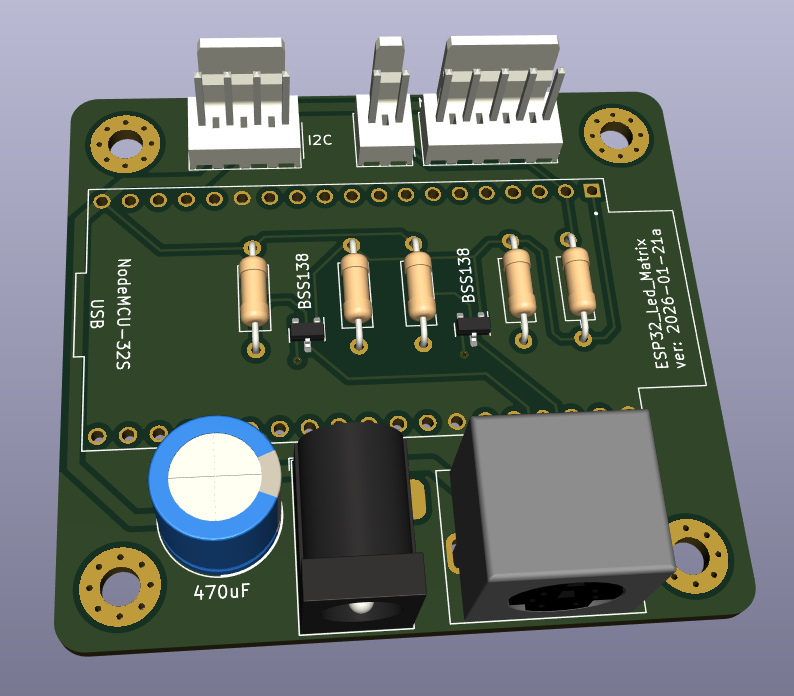
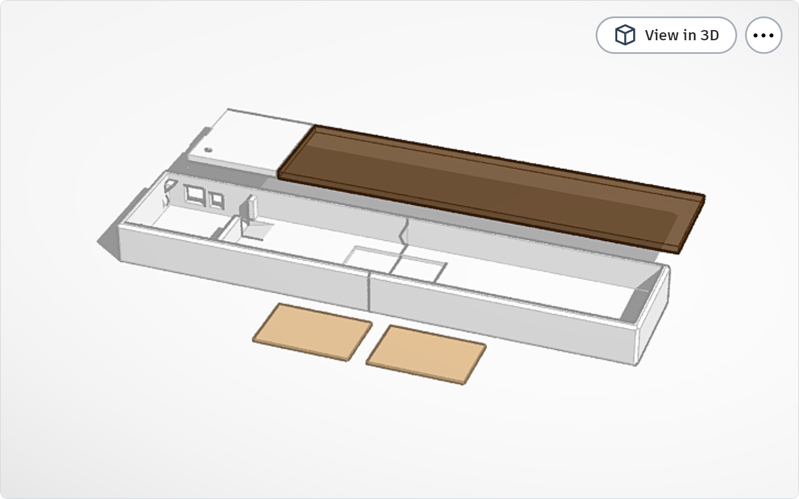

# 💡 ESP32 MAX7219 LED Matrix Display

這是一個基於 ESP32 的 LED 點矩陣顯示專案，整合了 WiFi 網頁設定、RTC 時間顯示、以及條碼掃描器輸入功能，適合用於創客空間或資訊看板。  
本專案提供兩種顯示規格的程式碼：
1.  **64x16 (寬版)**: 使用 16 個 MAX7219 模組 (雙排)。
2.  **64x8 (窄版)**: 使用 8 個 MAX7219 模組 (單排)。

## 📸 專案展示 (Gallery)

### 寬版 (64x16)

### 窄版 (64x8)

---

## ✨ 功能特色 (Features)

*   **📶 WiFi AP 設定介面**:
    *   ESP32 啟動後建立獨立熱點 (AP)，方便手機或電腦連線設定。
    *   提供網頁介面修改三組輪播訊息及同步系統時間。
    *   設定內容儲存於 EEPROM，斷電後資料不遺失。
*   **ℹ️ 資訊顯示**:
    *   **輪播訊息**: 支援三組自訂文字訊息 (僅支援英文)，具備滾動與進場動畫效果。
    *   **時間顯示**: 內建 RTC 模組，可顯示大字體時間 (時:分) 與完整日期資訊。
    *   **雙區顯示**:
        *   **64x16**: 分為上下兩區 (Zone Upper / Zone Lower)。
        *   **64x8**: 分為左右兩區 (Zone Left / Zone Right)。
*   **🔫 條碼掃描互動**:
    *   支援 PS2 介面的條碼掃描器。
    *   掃描條碼後，螢幕會暫停輪播，立即顯示掃描到的內容 (停留 30 秒)。
*   **🌱 節能排程**:
    *   內建工作時間判斷，僅在 **08:30 ~ 17:30** 開啟顯示，其餘時間自動關閉以節省電力。

## 📦 版本說明 (Versions)

### 1. 64x16 寬版 (主要版本)
*   **程式碼路徑**: `esp32_MAX7219_64x16/`
*   **硬體配置**: 16 個 MAX7219 模組，排列為 64行 x 16列。
*   **顯示邏輯**: 上下兩行同步顯示或顯示不同資訊。

### 2. 64x8 窄版
*   **程式碼路徑**: `esp32_MAX7219_64x8/`
*   **硬體配置**: 8 個 MAX7219 模組，排列為 64行 x 8列 (單排)。
*   **顯示邏輯**:
    *   **左側 (Zone Left)**: 固定顯示時間 (時:分)。
    *   **右側 (Zone Right)**: 輪播文字訊息。

## 🛠️ 硬體與製作 (Hardware & Build)

### 📝 材料清單 (BOM)
1.  **微控制器**: NodeMCU-32S (ESP32)
2.  **顯示模組**: MAX7219 Dot Matrix Module (FC-16 形式)
    *   64x16 版本需 16 片 (或 4 組 4合1 模組串接)
    *   64x8 版本需 8 片
3.  **RTC 時鐘模組**: DS3231
4.  **輸入裝置**: PS2 介面條碼掃描器 (或 PS2 鍵盤) + PS/2 母座
    
5.  **電源供應**:
    *   **64x16 版本**: 建議使用 **5V 4A** (至少 3A)，以確保全亮時系統穩定。
    *   **64x8 版本**: 建議使用 **5V 2A**。
6.  **其他**:
    *   Reset Button
        
    *   PCB (可參考下方 Gerber 檔)
    *   3D 列印外殼
    *   強力磁鐵 (直徑 18.2mm / 厚 2mm)
    *   深色透明壓克力 (雷射切割)

### 🔌 接線說明 (Pinout)

| 模組 | 接腳名稱 | ESP32 GPIO | 備註 |
| :--- | :--- | :--- | :--- |
| **MAX7219** | CLK | 18 | SPI Clock |
| | DATA (DIN) | 23 | SPI MOSI |
| | CS | 5 | Chip Select |
| **PS2 Scanner** | Data | 36 | Input Only |
| | Clock | 39 | Input Only |
| **DS3231** | SDA | 21 | I2C SDA (Default) |
| | SCL | 22 | I2C SCL (Default) |

### 原理圖 (Schematic)

### PCB 設計

### 3D 外殼模型

* 寬版(64x16) Tinkercad Model: https://www.tinkercad.com/things/0vOz0woKdCv-
* 窄版(64x8) Tinkercad Model: https://www.tinkercad.com/things/j6S2HNCI5wD-

## 軟體設定 (Software Setup)

### 函式庫依賴
請在 Arduino IDE 中安裝以下函式庫：  
*註：版本號為開發時使用的版本，建議使用最新版，若有問題可嘗試回退。*  
1.  Arduino IDE :  1.8.19  
2.  ESP32 Board Library : 3.0.4  
3.  `MD_Parola` by MajicDesigns (v3.7.3)
4.  `MD_MAX72xx` by MajicDesigns (v3.5.1)
5.  `Bonezegei_DS3231` (v1.0.2)
6.  `PS2Keyboard` (v2.4)
7.  `Time` (TimeLib) (v1.6.1)
    

## 🚀 使用說明 (Usage)

1.  **⚡ 啟動**: 送電後，顯示器會顯示初始訊息或時間。
2.  **🔗 連線設定**:
    *   搜尋 WiFi SSID: `ESP32_LedDisplay` (64x16) 或 `LedDisplay_Nory` (64x8)
    *   密碼: `ESP32_LedDisplay` (64x16) 或 `LedDisplay_Nory` (64x8)
    *   *註：SSID 與密碼定義於程式碼開頭，可自行修改。*
3.  **🌐 網頁控制**:
    *   開啟瀏覽器，輸入網址 `http://192.168.4.1`
    *   **Text Setting**: 輸入 Message 1~3，點擊 "Send Text" 更新顯示。
    *   **Reset Time**: 點擊可將 ESP32 時間同步為目前瀏覽器裝置的時間。
4.  **🔢 條碼輸入**:
    *   直接使用連接的掃描器掃描條碼，螢幕將顯示 "Input: [條碼內容]"。

## ⚠️ 注意事項
*   **工作時間**: 若在 08:30 前或 17:30 後測試，螢幕將保持關閉。可修改程式碼中的 `isWorkTime()` 函式調整時段。
*   **PS2 接腳**: GPIO 36/39 為僅輸入 (Input Only) 接腳，適用於單向傳輸的掃描器。

---